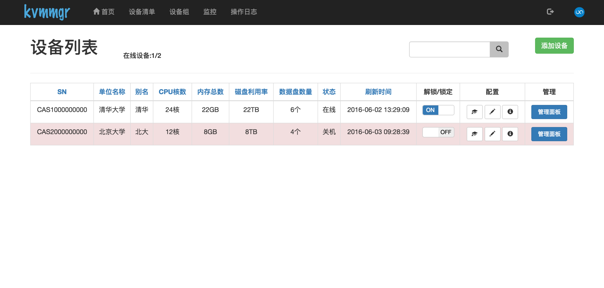
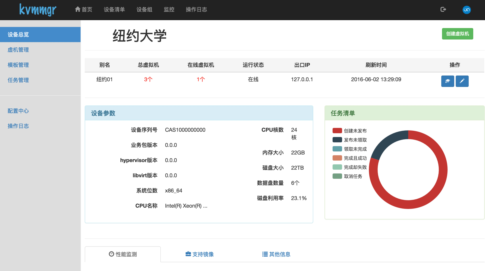
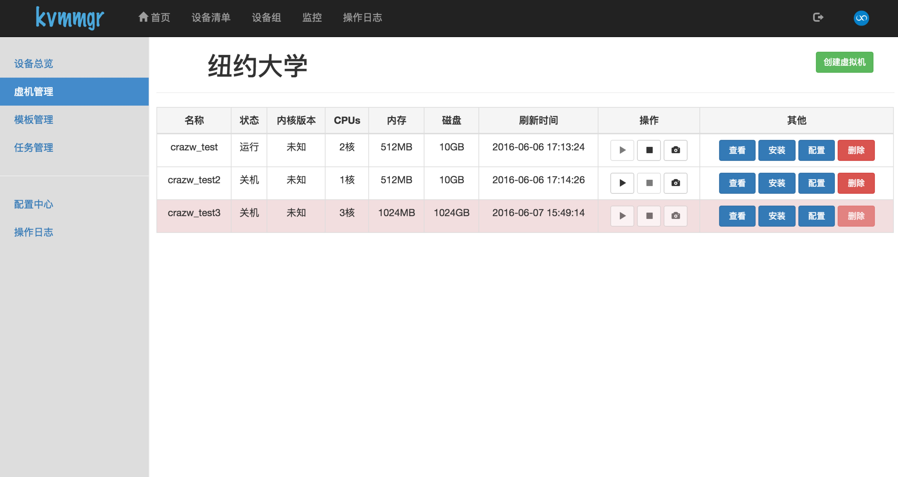
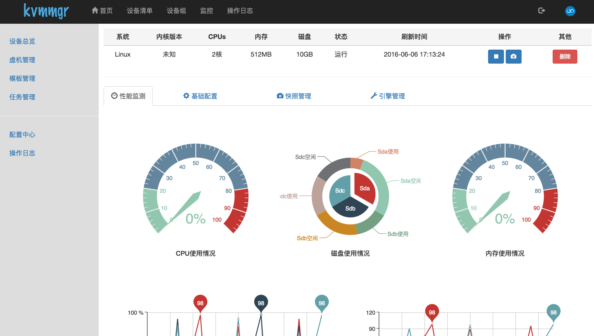
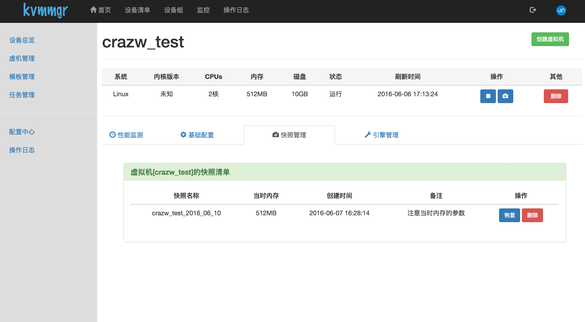
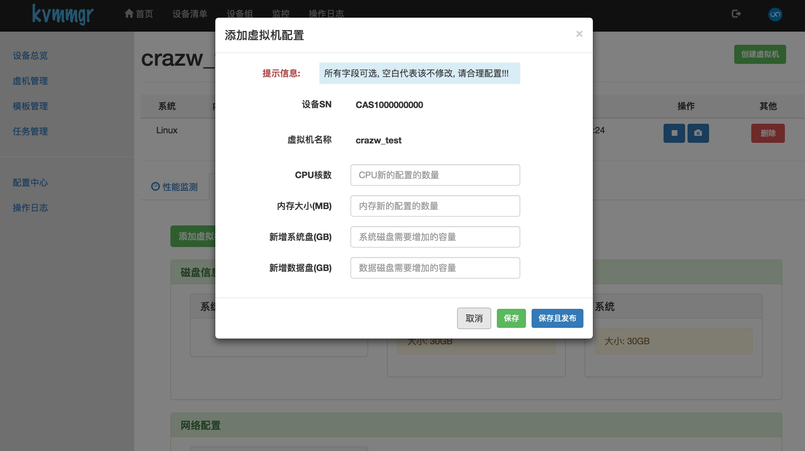
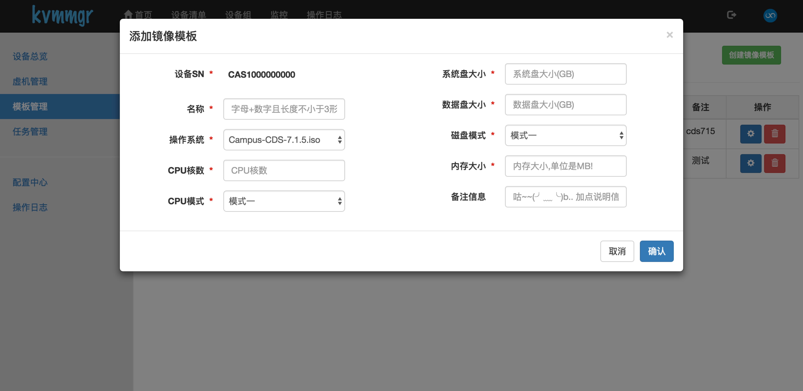
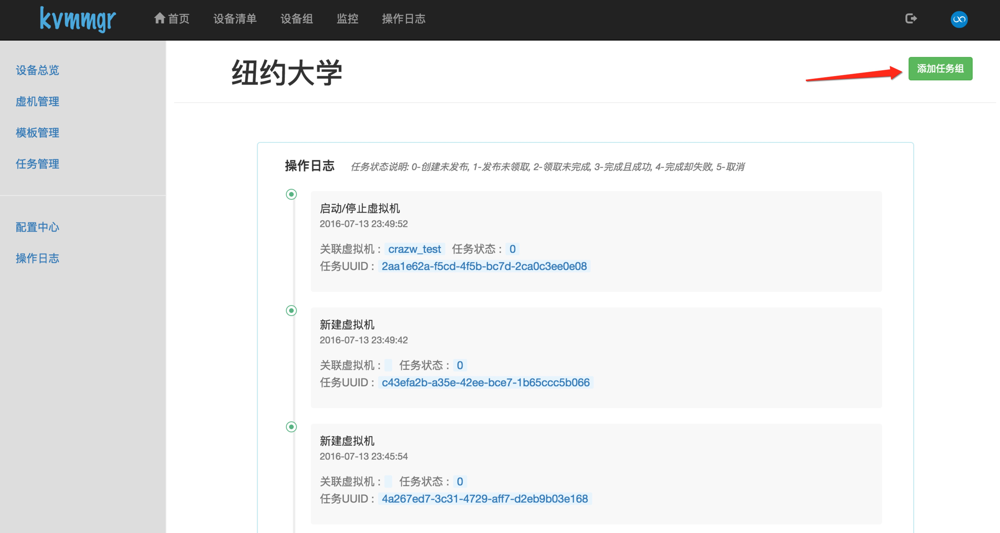

# webkvmmgr
KVM Manager with Django

## Demo video
[http://v.qq.com/page/w/7/1/w0313ztcu71.html](http://v.qq.com/page/w/7/1/w0313ztcu71.html)

## Requirements
### 宿主机
1. host目前选择版本: centos6.x 或 centos7
 
2. Host安装包:

    1) kvm相关包：
        yum install qemu-kvm libvirt libvirt-python
        
    2) python依赖包：
        requests、threadpool
        
    3) 其它rpm包：
    ​​  util-linux
    
3. Disk配置：

    1) 指定1块硬盘，例如/dev/sda，用来存放vm的系统盘；
    
    2) 格式化，并挂载到/img/os目录；
    
    3) 指定剩下的N-1块硬盘，用来存放vm的数据盘；（如果硬盘做了raid，则意味着，这个raid盘，用来存放vm的数据盘）
    
    4) 格式化，并挂载到/img/dataN目录；
 
    举例：
    ​例如一个host有5块盘，sda/sdb/sdc/sdd/sde，则：
    
    1) 选择sda用来存放vm的系统盘；
    
    2) 格式化并挂载：
        mkfs.ext4 /dev/sda  && mount /dev/sda /img/os
        
    3) 选择sdb/sdc/sdd/sde，用来存放vm的数据盘；
    
    4) 格式化并挂载：
    ```
        mkfs.ext4 /dev/sdb  && mount /dev/sdb /img/data1
        mkfs.ext4 /dev/sdc  && mount /dev/sdc /img/data2
        mkfs.ext4 /dev/sdd  && mount /dev/sdd /img/data3
        mkfs.ext4 /dev/sde  && mount /dev/sde /img/data4
    ```
    
4. net配置：
    创建一个名叫ovirtmgmt的网桥
    
### 虚拟机
1. 安装rpm包qemu-guest-agent：
    yum install qemu-guest-agent
 
2. 添加开机自启动程序：
    killall qemu-ga
    nohup qemu-ga -p /dev/virtio-ports/org.qemu.guest_agent.0  &

## Screenshot

* 登录页


* 设备列表页



* 设备总览



* 虚拟机列表



* 虚拟机总览



* 虚拟机快照管理



* 虚拟机配置




* 添加镜像模板



* 任务管理




## Todo List
* 重新组织agent代码, 现在代码还没有整理;
* 完善文档;